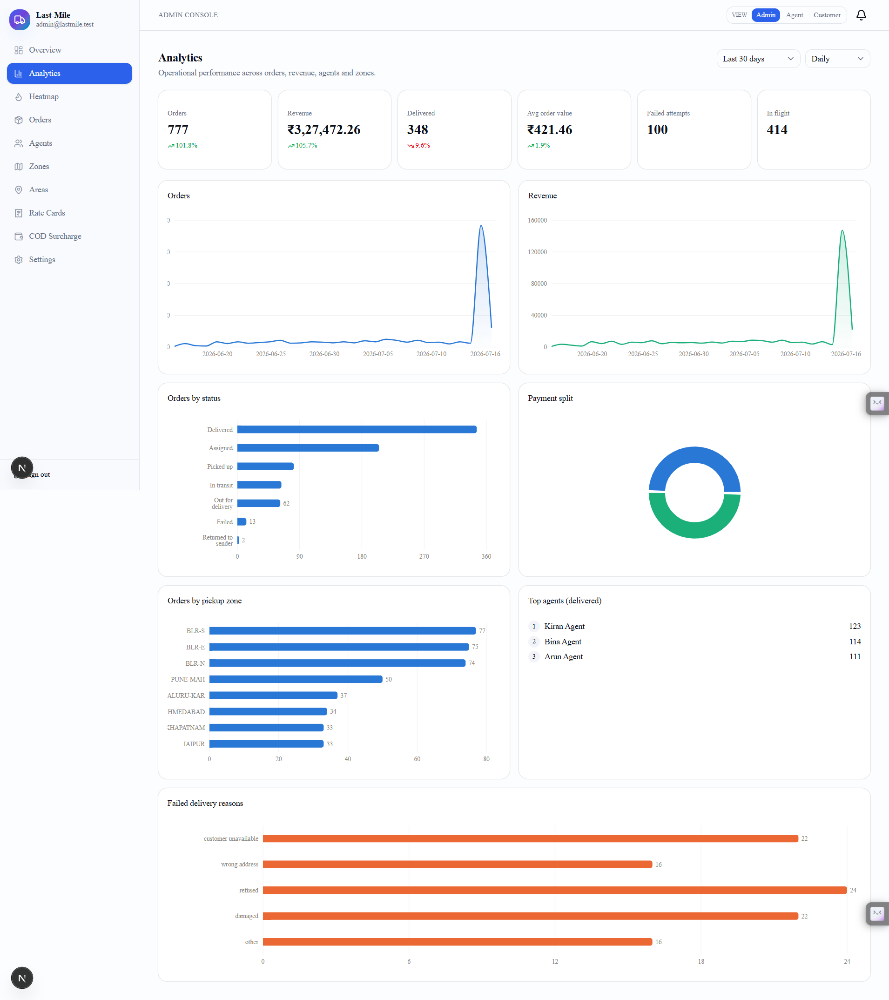
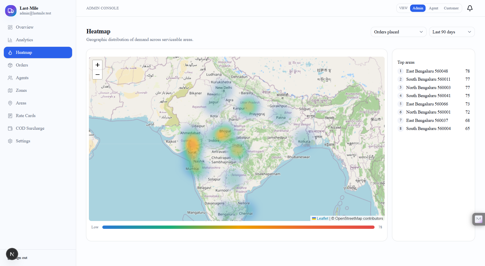
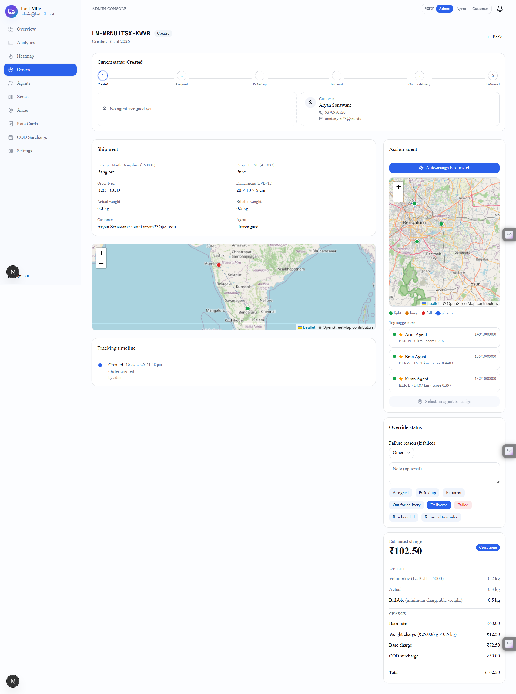

# Last-Mile Delivery Tracker

A delivery management platform where customers and admins create orders with **auto-calculated
charges**, agents are **assigned intelligently**, and customers are **notified and can track live**
at every step. Built as a full-stack logistics engineering project.

- **Live app:** [Deployed App](https://last-mile-delivery-tracker-app.vercel.app)
- **Demo logins** (after seeding) — password **`Password123!`**:
  - Admin — `admin@lastmile.test`
  - Agents — `agent1@lastmile.test`, `agent2@lastmile.test`, `agent3@lastmile.test`
  - Customers — `customer1@lastmile.test`, `customer2@lastmile.test`
- **Public tracking** needs no login: `/track/<TRACKING_NUMBER>`. **Rate calculator:** `/rate-calculator`.

---

## Screenshots

| Analytics dashboard | Agent-load heatmap |
|---|---|
|  |  |

**Order detail** — live assignment map, status stepper with handler contact, and the immutable tracking timeline:



---

## Features (mapped to the brief)

| Requirement | Where |
|---|---|
| Admin manages **zones** (map + radius) and **areas** (fuzzy pincode search, create/edit, reassign) | `/admin/zones`, `/admin/areas` |
| Admin configures rate cards (intra/inter × B2B/B2C) + COD surcharge — **no hardcoding**, one active entry per key | `/admin/rate-cards`, `/admin/cod-configs`, `/admin/settings` |
| Register as **customer or agent** (one email can be both), login switcher; admin can order **on behalf of** a customer | `/register`, `/login`, `/app/orders/new`, `/admin/orders/new` |
| Order form: **pick pickup/drop on a map** (reverse-geocode → pincode + address) or type a pincode (live area confirmation) | `components/orders/order-form.tsx`, `/api/pincodes/{lookup,nearest}` |
| Zone detection + volumetric weight (L×B×H÷5000) + billable = max(actual, volumetric) + rate card + COD, **shown before confirm** | `lib/domain/rate-engine.ts`, `lib/orders/pricing.ts`, `/rate-calculator` |
| **Auto-assign toggle** (off by default) or **manual assign on a live agent map** (colour-coded by load, top-3 suggestions) | `lib/orders/assign.ts`, `/admin/settings`, `/admin/orders/[id]` |
| Explainable assignment score — distance, workload (capacity + committed route), zone, **route-direction alignment**, rating | `lib/domain/assignment.ts` |
| Agents set a **fixed serving location** (the distance centre); **can't cancel** a job | `/agent/profile`, `lib/orders/update-status.ts` |
| Agent updates status (Picked Up → … → Delivered); a **failed** attempt requires a remark; admin can override | `/agent/orders/[id]`, `lib/orders/update-status.ts` |
| Failed delivery → customer books **re-delivery within 3 days** (max **3 attempts**, same agent kept first) → then **returned to sender** | `lib/orders/reschedule.ts`, `lib/orders/attempts.ts`, `/app/orders/[id]` |
| **Order status bar** on every order — lifecycle stepper + current handler + tap-to-call/email contacts | `components/orders/order-status-bar.tsx` |
| Live status + **immutable** tracking timeline | `OrderStatusHistory`, polling + Supabase Realtime |
| **Branded email + in-app + SMS** on every status change (SMTP email, **Twilio** SMS with mock fallback) | `lib/notifications/*` |
| Admin views all orders (row-clickable), filters by status/zone/agent, overrides any status; **preview agent/customer views** | `/admin/orders`, admin view switcher |
| Bulk **CSV import** (agents / areas / orders) with a downloadable sample template | `components/common/csv-import.tsx` |
| **Standout:** analytics dashboard, agent-load heatmap + live map | `/admin/analytics`, `/admin/heatmap`, Leaflet on tracking/detail |

---

## Tech stack

- **Next.js 16** (App Router, TypeScript) — one codebase for UI + API route handlers; auth verified locally via Supabase `getClaims()` (ES256/JWKS), side-effects deferred with `after()`
- **Supabase** — Postgres database, Auth (capabilities via `app_metadata.roles`), Realtime (live tracking), Storage
- **Prisma 6** ORM (schema in [`prisma/schema.prisma`](prisma/schema.prisma))
- **Tailwind CSS v4 + shadcn/ui** (Radix) · **Recharts** · **Leaflet** + **leaflet.heat** (OpenStreetMap) · **papaparse** (CSV)
- **Zod** validation · **TanStack Query** · **Nodemailer** (SMTP email) · **Twilio** (SMS) · **Vitest**

### Architecture

The **domain logic is pure and framework-free** — [`src/lib/domain/`](src/lib/domain/) modules
(`rate-engine`, `pricing-config`, `assignment`, `zones`, `status-machine`) never import Prisma or Next.
Route handlers load config/rows from the DB, call these pure functions, then persist. This makes the
rate engine and assignment logic trivially unit-testable (see `src/lib/**/__tests__`).

```
UI (RSC + client) ──► Route handlers (auth + Zod + orchestration) ──► pure domain ──► Prisma ──► Supabase Postgres
```

---

## Getting started

### Prerequisites
- Node.js 20+ and npm
- A free **Supabase** project — see **[docs/SUPABASE_SETUP.md](docs/SUPABASE_SETUP.md)**

### 1. Install
```bash
npm install
```

### 2. Configure environment
```bash
cp .env.example .env
```
Fill in the values (all documented in [`.env.example`](.env.example)). At minimum you need the
Supabase database URLs + API keys and (for real email) SMTP credentials. See the env reference below.

### 3. Create the schema + seed demo data
```bash
npm run db:deploy   # apply the migration (Supabase-friendly, no shadow DB)
npm run db:seed     # zones, areas, rate cards, COD, settings + demo users
```

### 4. Run
```bash
npm run dev         # http://localhost:3000
```

> **Local network note:** on some networks (NAT64/IPv6, e.g. certain ISPs) Prisma's engine can't reach
> the Supabase pooler by hostname (`P1001`). If so, pin the local `DATABASE_URL`/`DIRECT_URL` to a pooler
> **IPv4 + `sslmode=require`** (keep the hostname versions for Vercel). This does not affect production.

### Scripts
| Script | Purpose |
|---|---|
| `npm run dev` / `build` / `start` | Next.js dev / production build / serve |
| `npm run typecheck` / `lint` / `test` | TS check · ESLint · Vitest |
| `npm run db:deploy` | Apply migrations (`prisma migrate deploy`) |
| `npm run db:generate` / `db:push` / `db:studio` | Prisma client / push schema / Studio |
| `npm run db:seed` | Seed config (zones, areas, rate cards, COD, settings) + demo users |
| `npm run db:seed-pincodes` | Load the Indian pincode reference dataset into `PincodeRef` |
| `npm run db:provision` | Provision nationwide: one circular zone per city + all pincodes as serviceable areas |
| `npm run db:seed-orders [n]` | Generate ~n realistic demo orders across serviceable areas |

**Optional nationwide dataset** (beyond the minimal seed): run in order —
`db:seed` → `db:seed-pincodes` → `db:provision` → `db:seed-orders`.

---

## Environment variables

See [`.env.example`](.env.example) for the annotated template. Summary:

| Variable | Purpose |
|---|---|
| `DATABASE_URL` | Supabase **transaction pooler** (6543, `?pgbouncer=true`) — app runtime |
| `DIRECT_URL` | Supabase **session pooler** (5432) — migrations |
| `NEXT_PUBLIC_SUPABASE_URL` / `NEXT_PUBLIC_SUPABASE_ANON_KEY` | Supabase client (browser-safe) |
| `SUPABASE_SERVICE_ROLE_KEY` | Server-only: user creation (seed/registration), Realtime broadcast |
| `SMTP_HOST/PORT/SECURE/USER/PASSWORD/FROM` | Email notifications (e.g. Gmail app password) |
| `TWILIO_ACCOUNT_SID/AUTH_TOKEN/SMS_FROM` | Optional real SMS via **Twilio** (free trial = credit + a sender number). Unset → SMS is mock-logged. |
| `NEXT_PUBLIC_APP_URL` | Base URL for tracking/email links. On Vercel it **auto-falls back to the deployment domain** (`VERCEL_PROJECT_PRODUCTION_URL`), so email links are correct without extra setup; set this to pin a custom domain. |
| `AI_FEATURES_ENABLED` / `ANTHROPIC_API_KEY` | Optional AI features (off by default) |

---

## Rate calculation logic

Everything is **admin-configurable and stored in the database** — no hardcoded prices, zones, or the
volumetric divisor. The engine ([`src/lib/domain/rate-engine.ts`](src/lib/domain/rate-engine.ts)) is a pure
function:

```
volumetricWeight = (L × B × H) / volumetricDivisor         # divisor from Setting (default 5000)
billableWeight   = max(actualWeight, volumetricWeight, minChargeableWeight)
zoneType         = pickupZone === dropZone ? INTRA : INTER
rateCard         = active card for (orderType, zoneType)   # correct B2B/B2C + intra/inter
weightCharge     = rateCard.perKgRate × billableWeight
baseCharge       = rateCard.baseRate + weightCharge
codSurcharge     = COD ? (FLAT: amount | PERCENT: baseCharge × amount / 100) : 0
total            = baseCharge + codSurcharge
```

- **Zone detection** maps a pincode to exactly one zone via the admin-managed `Area` table
  ([`zones.ts`](src/lib/domain/zones.ts)). Unknown pincode → a clear "not serviceable" 422.
- **Rate cards & COD configs are versioned** (`effectiveFrom`/`effectiveTo`/`isActive`); the engine
  picks the active version at order time ([`pricing-config.ts`](src/lib/domain/pricing-config.ts)).
- **The charge is recomputed server-side** on order creation and the full breakdown is **snapshotted**
  immutably on the order, so historical orders stay correct even after rate cards change.
- The public **rate calculator** (`/rate-calculator`) and the order form both call `POST /api/quote`,
  which returns the full breakdown **before** the customer confirms.

Unit tests: [`rate-engine.test.ts`](src/lib/domain/__tests__/rate-engine.test.ts),
[`pricing-config.test.ts`](src/lib/domain/__tests__/pricing-config.test.ts),
[`pricing.test.ts`](src/lib/orders/__tests__/pricing.test.ts).

A fuller write-up (zone detection, auto-assignment, failed-delivery handling) is in
**[docs/SYSTEM_DESIGN.md](docs/SYSTEM_DESIGN.md)**.

---

## Assignment, lifecycle & notifications

**Auto-assign is a toggle** (`autoAssignEnabled` setting, **off by default**). When on, new orders are assigned
on creation and flipping it on sweeps the pending backlog. When off, admins assign manually from a **live agent
map** (colour-coded by load) with the **top-3 suggestions** listed, or click any free agent.

The **assignment score** is a pure, explainable function
([`lib/domain/assignment.ts`](src/lib/domain/assignment.ts)): distance to pickup (from the agent's **serving
location**) · workload (free capacity + committed route distance) · same-zone · **route-direction alignment**
(does the new leg match where the agent is already heading) · rating. The chosen agent's reasoning is stored on
the `Assignment` row, and the claim is an atomic conditional UPDATE so concurrent assignments can't over-book.

**Delivery lifecycle** is an explicit state machine
([`status-machine.ts`](src/lib/domain/status-machine.ts)). Agents move an order forward and **cannot cancel**
it; a failed attempt requires a remark. The customer then books **re-delivery within 3 days** — the same agent
is kept when free, else reassigned — and after **3 attempts** the order is automatically **returned to sender**.

**Notifications** fire on every status change ([`lib/notifications/*`](src/lib/notifications/)), idempotent per
`(order, status, attempt, channel)`: **branded HTML email** (SMTP), **in-app**, and **SMS via Twilio**
(mock-logged when unconfigured). Failed-delivery emails link to the authenticated order page so the customer can
book re-delivery — the login gateway signs them in first. Sending runs after the response via `after()`.

---

## Database schema

13 tables (full definitions in [`prisma/schema.prisma`](prisma/schema.prisma)):

- **Profile** — app user linked 1:1 to Supabase `auth.users`. **Capabilities model:** `roles Role[]` — one
  account can be CUSTOMER **and/or** AGENT (and/or ADMIN); `role` keeps the primary/highest for display.
- **AgentProfile** — status, live location, **fixed serving location** (`serviceLat/Lng/serviceAddress`, the
  distance centre), home zone, capacity (`activeOrders`/`maxActiveOrders`), rating.
- **Zone**, **Area** — circular zones (centre + radius) + pincode→zone mapping (zone detection source of truth).
- **PincodeRef** — reference dataset of Indian pincodes with geo (powers fuzzy area search, the map picker,
  reverse-geocoding, and the heatmap).
- **RateCard**, **CodConfig** — pricing with **exactly one active entry** per key (`@@unique` on
  `(orderType, scope)` / `orderType`); saving overwrites rather than stacking duplicates.
- **Setting** — global key/value (e.g. `volumetricDivisor`, `currency`, `defaultZoneRadiusKm`, `autoAssignEnabled`).
- **Order** — addresses + geo, package, weights, `orderType`, `paymentType`, immutable `chargeBreakdown`
  snapshot, `totalCharge`, `status` (…→ DELIVERED / FAILED / RESCHEDULED / **RETURN_TO_SENDER**),
  `currentAgentId`, `attemptNumber`.
- **OrderStatusHistory** — *append-only* audit log (status, actor, role, timestamp, note, reason, geo).
- **Assignment** — *append-only* record of each (re)assignment with the auto-assign reasoning.
- **RescheduleRequest** — captured new date + reason on failed deliveries.
- **Notification** — outbox with a unique `idempotencyKey` (email / in-app / SMS).

---

## API documentation

All handlers validate input with Zod and return errors as `{ error, details? }`. Auth is enforced
server-side per role.

### Public
| Method | Path | Description |
|---|---|---|
| `POST` | `/api/auth/register` | Create a **customer or agent** account (`accountType`); adds the capability if the email already exists |
| `POST` | `/api/quote` | Rate estimate (no persistence) — full breakdown |
| `GET` | `/api/pincodes/lookup?pincode=` | Confirm a pincode's locality + whether it's serviceable |
| `GET` | `/api/pincodes/nearest?lat=&lng=` | Reverse-geocode a map point to the nearest known pincode |
| `GET` | `/api/track/[trackingNumber]` | Public tracking (status + timeline + zones + agent) |
| `GET` | `/api/health` | Liveness + DB check |

### Customer / Agent / Admin (authenticated)
| Method | Path | Role | Description |
|---|---|---|---|
| `GET` | `/api/orders` | any | List orders (scoped to role; admin filters `status/zoneId/agentId`; admin previews agent/customer views) |
| `POST` | `/api/orders` | customer/admin | Create order (admin passes `customerId`); geocodes pincodes + auto-assigns when enabled |
| `GET` | `/api/orders/[id]` | owner/assigned/admin | Order detail + history + handler contact |
| `POST` | `/api/orders/[id]/assign` | admin | Assign agent (`{mode:"MANUAL",agentId}` or `{mode:"AUTO"}`) |
| `GET` | `/api/orders/[id]/candidates` | admin | Ranked agents (score + coords + load) for the manual-assign map |
| `POST` | `/api/orders/[id]/status` | agent/admin | Update status (`{status,note?,reason?,lat?,lng?}`); remark required on FAILED |
| `POST` | `/api/orders/[id]/reschedule` | customer/admin | Book re-delivery for a failed order (`{requestedDate,reason?}`, ≤3 days) |
| `GET`/`PATCH` | `/api/agent/profile` | agent | View / edit own serving location + availability |
| `GET` | `/api/notifications` · `POST .../read` | any | In-app notifications + mark read |

### Admin configuration
`GET/POST /api/admin/{zones,areas,rate-cards,cod-configs}` · `PATCH/DELETE /api/admin/{…}/[id]` ·
`POST /api/admin/{agents,areas,orders}/bulk` (CSV import) · `GET/PUT /api/admin/settings` ·
`GET/POST /api/admin/admins` + `DELETE /api/admin/admins/[id]` (invite / revoke) ·
`GET /api/admin/customers` · `GET/POST /api/admin/agents` · `GET /api/admin/pincodes/{search,facets}` ·
`GET /api/admin/analytics` · `GET /api/admin/analytics/heatmap`.

---

## Testing

```bash
npm run test        # Vitest — pure domain logic (rate engine, pricing config, assignment, status machine, tracking)
```

The graded rate engine has a table-driven suite covering volumetric-vs-actual selection, INTRA/INTER,
B2B/B2C, COD flat/percent, min-chargeable weight, and error cases.

---

## Deployment

Deploy the app to **Vercel** and point it at the same Supabase project. Full steps (env vars, and using
the hostname URLs in production vs the local IPv4 pin) are in **[docs/DEPLOY.md](docs/DEPLOY.md)**.

---

## Project docs
- [docs/BLUEPRINT.md](docs/BLUEPRINT.md) — full design & phased plan
- [docs/SYSTEM_DESIGN.md](docs/SYSTEM_DESIGN.md) — ≤800-word system-design write-up
- [docs/SUPABASE_SETUP.md](docs/SUPABASE_SETUP.md) — Supabase project setup
- [docs/DEPLOY.md](docs/DEPLOY.md) — Vercel deployment
